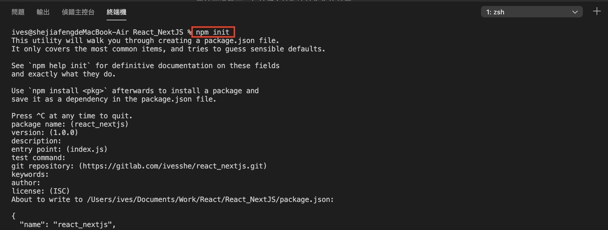
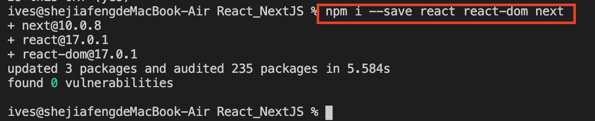
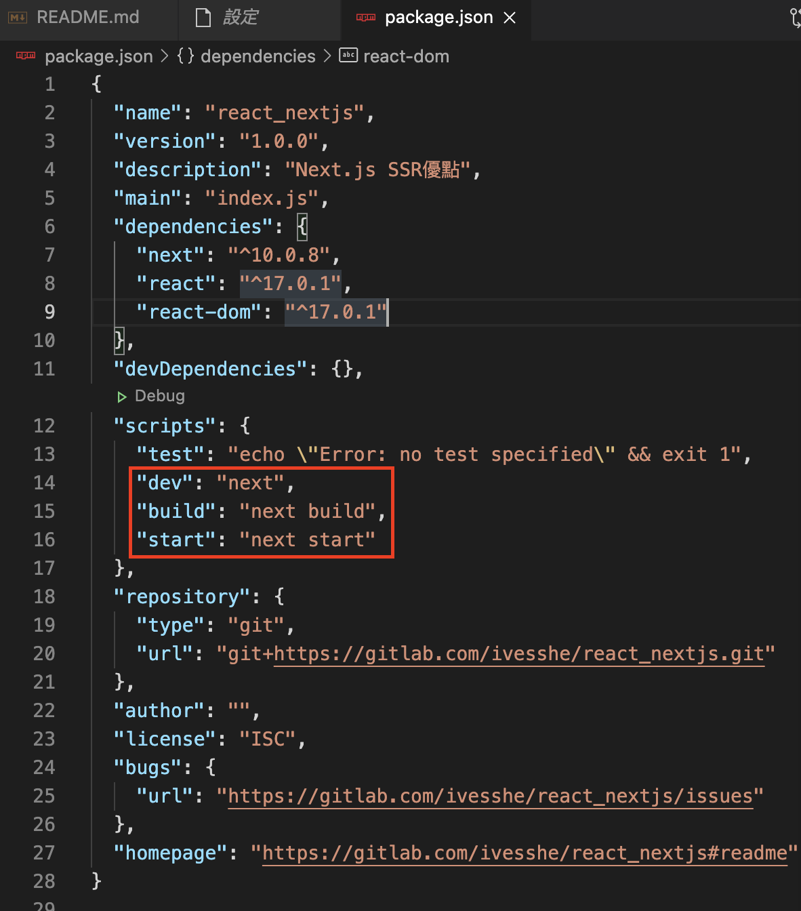
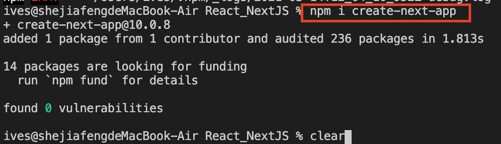
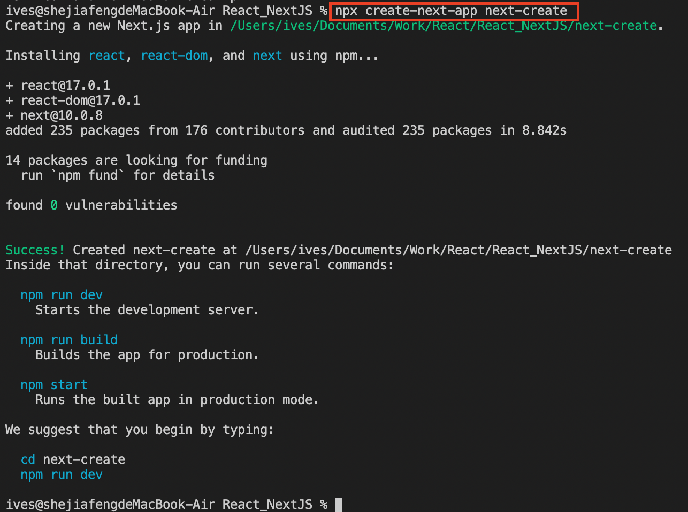
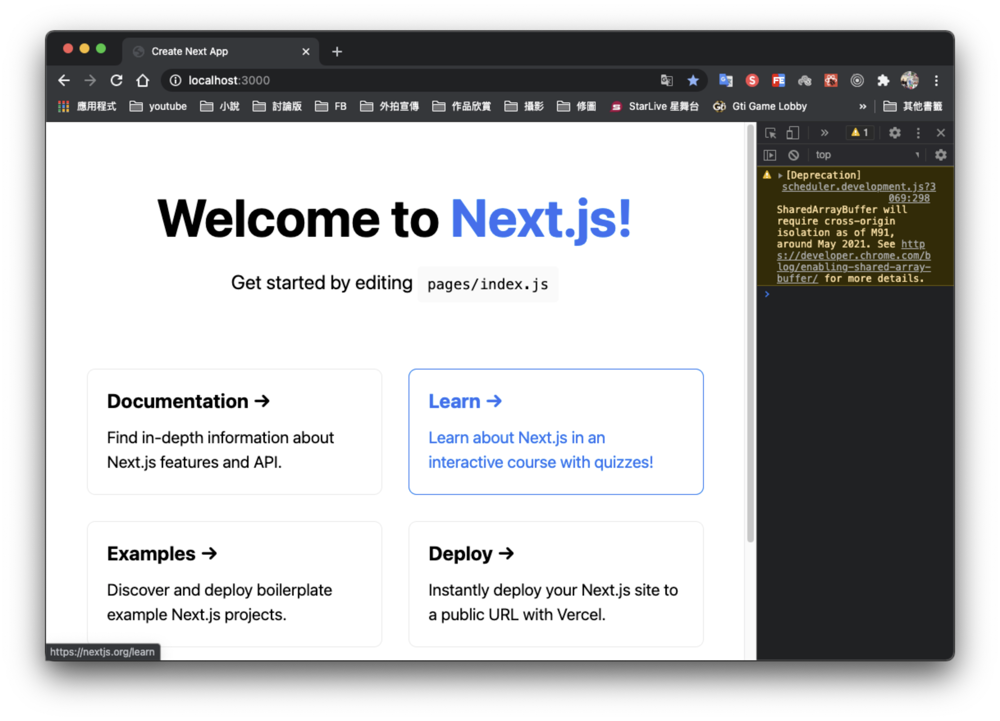
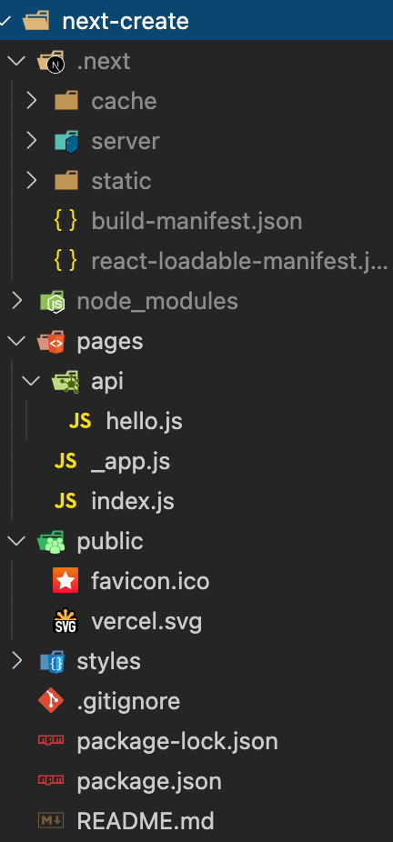

# React 使用Next.js

Next.js SSR優點

1. 搭建輕鬆
2. 自帶數據同步SSR(服務端渲染)
3. 豐富插件，自己形成生態
4. 配置靈活

# 手動創建方式(知道即可)

## 安裝

```bash
npm init
```



```bash
npm i --save react react-dom next
```



## 修改package.json

```json
"scripts": {
    "test": "echo \"Error: no test specified\" && exit 1",
    "dev": "next",
    "build": "next build",
    "start": "next start"
  },
```



## 運行

```bash
npm run dev
```


# 使用腳手架安裝(真實項目使用)

安裝腳手架

```bash
npm i -g create-next-app
```

加-g可能權限不夠無法安裝，後來把-g拿掉



# 創建新項目

```bash
npx create-next-app next-create
```



# 運行

```bash
cd next-create
npm run dev
```

運行成功了



# 框架原始資料夾結構

